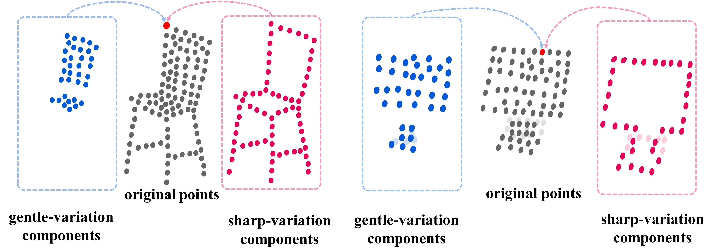

# Learning Geometry-Disentangled Representation for Complementary Understanding of 3D Object Point Cloud. 
This repository is built for the paper:

__Learning Geometry-Disentangled Representation for Complementary Understanding of 3D Object Point Cloud. (_AAAI2021_)__ [[arXiv](https://arxiv.org/abs/2012.10921)]
<br>
by [Mutian Xu*](https://mutianxu.github.io/), [Junhao Zhang*](https://junhaozhang98.github.io/), Zhipeng Zhou, Mingye Xu, Xiaojuan Qi and Yu Qiao


## Overview


Futher information please contact Mutian Xu (mino1018@outlook.com) or Junhao Zhang (junhaozhang98@gmail.com).

## Citation
If you find the code or trained models useful, please consider citing:

    @misc{xu2021learning,
      title={Learning Geometry-Disentangled Representation for Complementary Understanding of 3D Object Point Cloud}, 
      author={Mutian Xu and Junhao Zhang and Zhipeng Zhou and Mingye Xu and Xiaojuan Qi and Yu Qiao},
      year={2021},
      eprint={2012.10921},
      archivePrefix={arXiv},
      primaryClass={cs.CV}


## Installation


### Requirements
* Linux (tested on Ubuntu 14.04/16.04)
* Python 3.5+
* PyTorch 1.0+

## Usage

### 3D Object Classification on ModelNet40
* Train:
``` 
python main.py 
```
* Test:
    * Run the voting evaluation script, after this voting you will get an accuracy of 93.8% if all things go right:
    ```
    python voting_evaluate_modelnet.py --model_path 'pretrained/GDANet_ModelNet40_93.4.t7'
    ```
    
    * You can also directly evaluate our pretrained model without voting to get an accuracy of 93.4%:
    ```
    python main.py --eval True --model_path 'pretrained/GDANet_ModelNet40_93.4.t7'
    ```

## Other information
We will release classification model on ScanObjectNN and part segmentation code later. 

## Acknowledgement
This code is is heavily borrowed from [DGCNN](https://github.com/WangYueFt/dgcnn).  